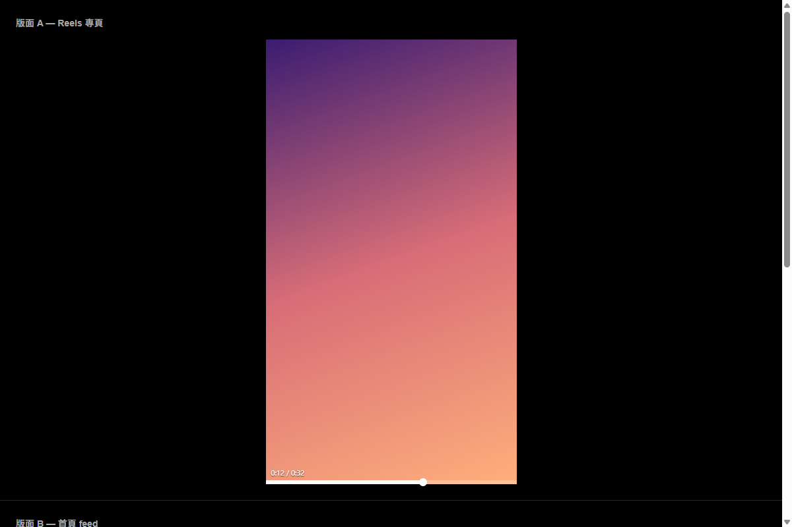

# Instagram Reels 進度條

為 Instagram 網頁版的 Reels 與影片加上一條可以拖曳的進度條。Instagram 原本沒有進度條，只能從頭看到尾；裝上之後可以直接跳到想看的位置。



## 功能

- 影片底部的進度條，可拖曳、可點擊跳轉
- Hover 時長高、出現拖曳圓點與時間標籤 `0:07 / 0:32`
- 拖曳時標籤即時顯示「放開會跳到哪」
- 顯示已緩衝範圍，一眼看出拖到哪裡是安全的
- 生效頁面：Reels 專頁 `/reels/`、首頁 feed、貼文燈箱 `/p/`、探索頁 `/explore/`

## 安裝

1. Chrome 網址列輸入 `chrome://extensions`
2. 右上角開啟「開發人員模式」
3. 點「載入未封裝項目」
4. 選擇這個專案的根目錄（含 `manifest.json` 的那一層）

安裝不需要 `npm install`，也不需要跑任何建置指令 —— 可執行的 `dist/content.js` 已經在版控裡了。

只有在你**改動 `src/` 底下的程式碼**之後，才要重新產生它：

```bash
node tools/build.mjs
```

然後回到 `chrome://extensions` 按該擴充功能的重新整理。

## 驗收清單

- [ ] 開 `instagram.com/reels/`，滑鼠移到影片底部，進度條長高並出現圓點與時間
- [ ] 拖曳圓點，影片跳到對應位置
- [ ] 直接點進度條上任一點，影片跳到那裡
- [ ] 上下滑切換 Reels，進度條跟著切到新影片
- [ ] 回首頁捲動 feed，進度條跟著畫面中央的影片走
- [ ] 點開任一貼文燈箱（`/p/...`），進度條正常出現
- [ ] 探索頁點開影片，進度條正常出現
- [ ] 小縮圖上不會出現進度條

## 自訂外觀

所有可調數值都在 `src/content/config.js`。改完要跑 `node tools/build.mjs` 再重新載入擴充功能。

| 常數 | 預設 | 說明 |
|---|---|---|
| `COLOR_PLAYED` | `#ffffff` | 已播放的顏色。想換 YouTube 紅改 `#ff0033`，想換 Instagram 藍改 `#0095F6` |
| `HIT_ZONE_HEIGHT` | `16` | 影片底部感應區高度。這是唯一會攔截 Instagram 原生點擊的區域，覺得太容易誤觸就調小 |
| `BAR_HEIGHT_IDLE` | `3` | 閒置時的進度條高度 |
| `BAR_HEIGHT_HOVER` | `6` | Hover 時的進度條高度 |
| `HANDLE_SIZE` | `12` | 拖曳圓點直徑 |
| `MIN_VISIBLE_RATIO` | `0.5` | 影片露出多少比例才會被選為作用中 |

## 已知限制

- **影片底部 16px 由進度條接管**，該區域的 Instagram 原生點擊會被攔截。這是加入 scrubber 無法避免的代價，YouTube 也是如此。嫌礙事可以把 `HIT_ZONE_HEIGHT` 調小。
- **拖到尚未緩衝的位置可能會卡住。** Instagram 用 MSE 串流播放，能不能跳過去取決於它自己的播放器會不會去抓那段資料。進度條把已緩衝範圍畫成較亮的顏色，事先就看得出安全範圍；真的卡住時圓點會轉圈。
- **直播不顯示進度條。** 直播的 `duration` 是 `Infinity`，沒有進度可言。

## 開發

```bash
npm install         # 只裝測試工具，擴充功能本身零依賴
npm test            # 112 個單元測試
npm run test:watch
npm run build       # 把 src/ 攤平成 dist/content.js
npm run icons       # 重新產生圖示
```

版面驗證頁（不需要登入 Instagram 就能測拖曳與定位）：

```bash
node tools/serve.mjs
```

- `http://localhost:8123/test/fixtures/mock-instagram.html` — 載入 `src/` 的 ES modules，三種版面（Reels、feed、燈箱）加小縮圖
- `http://localhost:8123/test/fixtures/mock-instagram-bundle.html` — 載入 `dist/content.js` 並套用嚴格 CSP，驗證實際會被注入的那支腳本

兩頁的 `<video>` 都是真實元素，只有媒體屬性（`duration` / `currentTime` / `buffered`）被換成可控的假值，所以不需要任何影片檔案，結果完全確定。

## 架構

不修改 Instagram 的 DOM。在 `document.body` 掛一個 Shadow DOM 浮層，用 `position: fixed` 疊在「當前作用中的那支 `<video>`」上，逐幀依 `getBoundingClientRect()` 對齊。

唯一的 DOM 錨點是 `<video>` 標準元素。Instagram 的 CSS class 是編譯產生的雜湊字串且會隨版本改變，任何綁定它們的做法都會很快失效。

浮層分兩層：外層 host 高 48px、`pointer-events: none`，只是定位容器與時間標籤的畫布；內層貼齊底部的 16px 條帶才是 `pointer-events: auto`。所以標籤有空間顯示，被攔截的原生點擊區域仍然只有底部 16px。

### 為什麼有 `dist/`

MV3 的 content script 是 classic script，不支援 `import`。常見解法是動態 `import(chrome.runtime.getURL(...))`，可以完全免建置，但那條路無法在這台機器上自動驗證（Chrome 151 已移除 `--load-extension`，跑不了自動化的擴充功能測試），而它一旦被 CSP 擋下，整個功能會靜默失效。

所以改成把 `src/` 攤平成單一 classic script。沒有動態載入環節，失敗模式消失，而且攤平後的產出可以直接當一般 `<script>` 載入來實測 —— 這件事已經在真實 Chrome 的嚴格 CSP 頁面上驗證通過。

`src/` 仍是唯一的原始碼真相，單元測試直接測它。`tools/build.mjs` 只做機械式串接，並在偵測到頂層宣告重名時直接失敗，避免串接後互相覆蓋。

| 檔案 | 職責 |
|---|---|
| `dist/content.js` | 由 `tools/build.mjs` 產生，manifest 實際載入的檔案 |
| `src/content/main.js` | 生命週期接線與 rAF 渲染迴圈 |
| `src/content/config.js` | 所有可調常數 |
| `src/content/geometry.js` | 純幾何：可視面積、指標位置換算 |
| `src/content/time-format.js` | 秒數格式化 |
| `src/content/media-state.js` | 緩衝終點、卡頓判定 |
| `src/content/video-tracker.js` | 選出當前作用中的影片 |
| `src/content/progress-bar.js` | Shadow DOM UI |
| `src/content/styles.js` | Shadow root 的 CSS |
| `src/content/seek-controller.js` | 指標事件 → 跳轉 |

設計文件在 `docs/superpowers/specs/`，實作計畫在 `docs/superpowers/plans/`。
