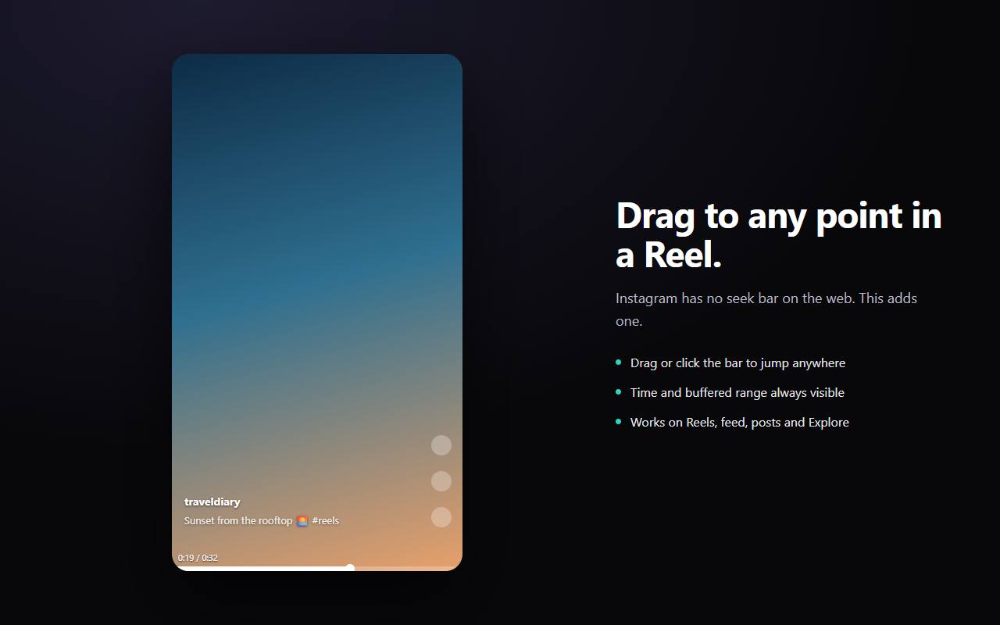

Instagram's web player has no seek bar. You can't skip ahead, you can't go back to the part you missed, and you can't tell how long a video is. This extension adds the bar that should have been there.



## What it does

- Drag or click anywhere on the bar to jump to that point
- Current time and total length, shown while you're using the bar
- The buffered range is drawn in a lighter shade, so you can see how far ahead is safe to jump to
- Works on the Reels page, the home feed, post lightboxes and Explore
- Adjustable bar thickness, handle size and hover area; the time label can be switched off

## Install

From the source in this repository:

```bash
npm install
npm run build
```

Then open `chrome://extensions`, turn on Developer mode, choose **Load unpacked**, and select `.output/chrome-mv3`.

## Something broken?

Instagram changes its site regularly. If the bar stops appearing or behaves oddly, please [open an issue](https://github.com/TSinChen/instagram-reels-progress-bar/issues) rather than leaving a review — issues can actually be fixed.

Useful details to include: the page you were on (Reels, feed, a post, Explore), your Chrome version, and whether anything shows up in the console.

## Privacy

No data collection of any kind. No analytics, no telemetry, no servers, no network requests. The only thing stored is your appearance settings, kept in your own browser profile.

[Full privacy policy](privacy)

## Not affiliated with Instagram

This is an independent project. It is not affiliated with, endorsed by, or sponsored by Instagram or Meta.

---

# 中文

Instagram 網頁版的播放器沒有進度條。你沒辦法快轉、沒辦法回去看漏掉的片段，也不知道影片到底多長。這個擴充功能把本來就該有的那條進度條補上。

## 功能

- 拖曳或點擊進度條上任一點，直接跳到那裡
- 使用進度條時會顯示目前時間與影片總長度
- 已緩衝的範圍會用較亮的顏色畫出來，一眼看出拖到哪裡是安全的
- Reels 專頁、首頁動態、貼文燈箱、探索頁都能用
- 進度條粗細、圓點大小、感應區高度都可調，時間標籤也能關掉

## 壞掉了？

Instagram 會不定期改版。如果進度條不見了或行為怪怪的，請[開一個 issue](https://github.com/TSinChen/instagram-reels-progress-bar/issues)，不要直接留評論 —— issue 才修得到。

附上這些會很有幫助：你在哪個頁面（Reels、首頁、貼文、探索）、Chrome 版本、主控台有沒有訊息。

## 隱私

不蒐集任何資料。沒有分析工具、沒有遙測、沒有伺服器、不發任何網路請求。唯一儲存的是你的外觀設定，存在你自己的瀏覽器設定檔裡。

[完整隱私權政策](privacy)

## 與 Instagram 無關

這是獨立開發的專案，與 Instagram 及 Meta 無任何隸屬、背書或贊助關係。
